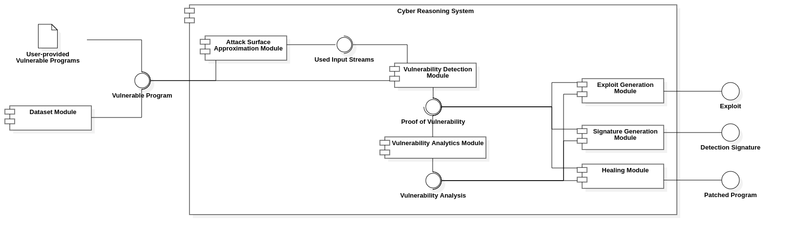

# Repositories

The repositories are divided in two categories, depending on their **usage in the cyber reasoning system's implementation**. The **functional** ones are mapped to one module (or well-defined part of a module) of the overall architecture (shown above), while the **nonfunctional** are organization-centric.

Click to see the overall architecture.

The repositories that have no attached GitHub repository link are not yet started.

## Functional

- **[`dataset`](https://github.com/CyberReasoningSystem/dataset)** for compiling and managing vulnerable programs
    - **[`nist_c_test_suite`](https://github.com/CyberReasoningSystem/nist_c_test_suite)** for storing NIST's "C Test Suite for Source Code Analyzer v2 - Vulnerable" dataset
- **[`attack_surface_approximation`](https://github.com/CyberReasoningSystem/attack_surface_approximation)** for discovering the attack surface of a vulnerable program
- **`vulnerability_detection`** for finding vulnerabilities in executables
- **`vulnerability_analytics`** for analyzing found vulnerabilities to extract more information (for example, root cause)
- **`exploit_generation`** for generating exploits
- **`signature_generation`** for generating signatures catching exploit attempts
- **`healing`** for patching vulnerabilities found in 
- **`opencrs`** for aggregating all the modules.

## Nonfunctional

- **[`wiki`](https://github.com/CyberReasoningSystem/wiki)** as a non-functional, meta-repository for describing how OpenCRS works as an organization and storing miscellaneous information
    - **[`first_semester_research`](https://github.com/CyberReasoningSystem/first_semester_research)** for first semester's research
    - **[`second_semester_research`](https://github.com/CyberReasoningSystem/second_semester_research)** for second semester's research
- **[`awesome-binary-analysis`](https://github.com/CyberReasoningSystem/awesome-binary-analysis)** for helpful binary analysis tools and research materials.